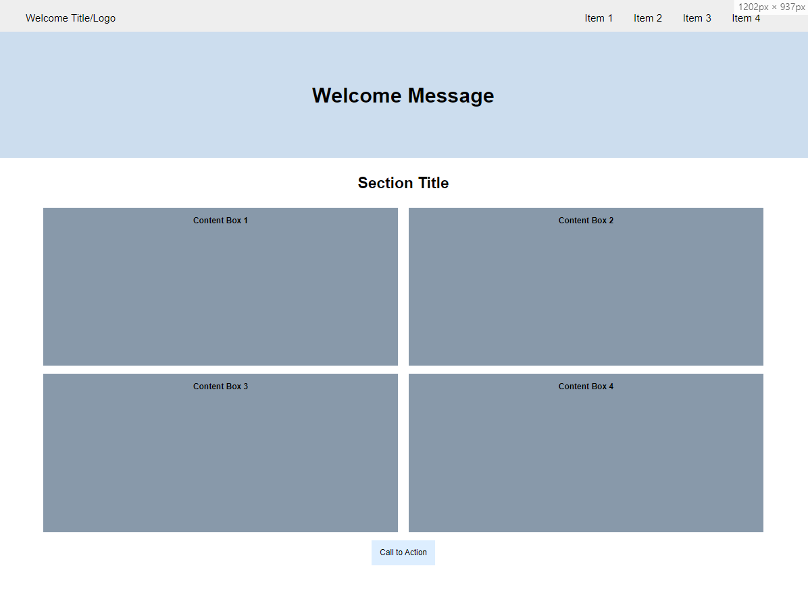
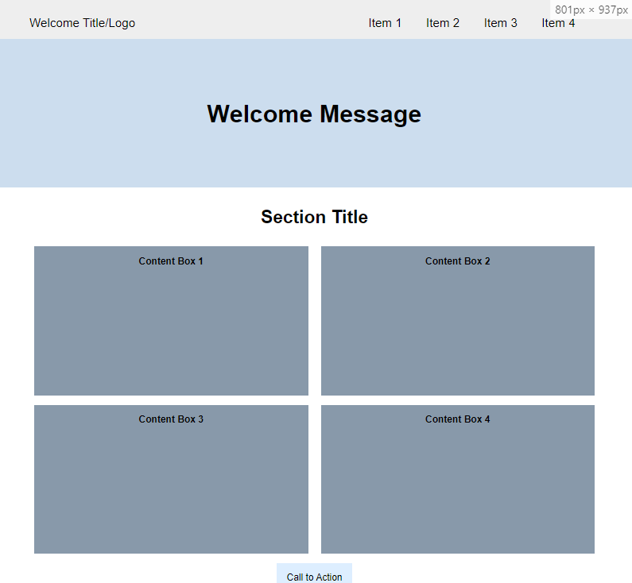
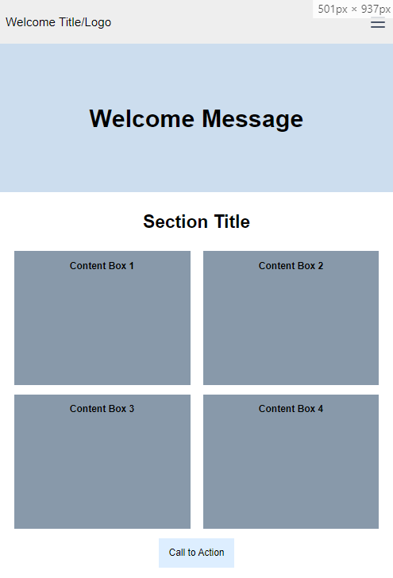
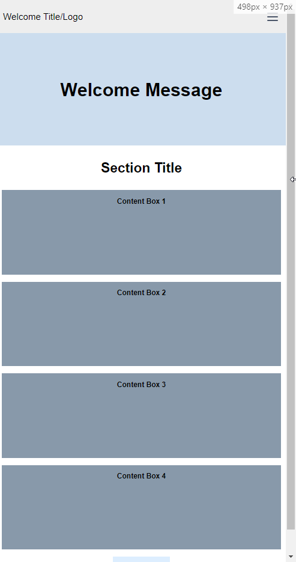

# Remote Assignments

---

## [1. Remote Assignments Week 1 link](https://akirap3.github.io/remote-assignments/week-1/index.html)

### Creating a repository and using GitHub Pages

### Pure HTML/CSS and the Layouts of

### (1) &gt; 1200px

### (2) &gt; 800px and &lt; 1200px

### (3) &gt; 500px and &lt; 800px

### (4) &lt; 500px

### Mobile-first design pattern to perform this assignment

## [2. Remote Assignments Week-1-Advanced link(emitating Google Developers Page)](https://akirap3.github.io/remote-assignments/week-1-advanced/index.html)
