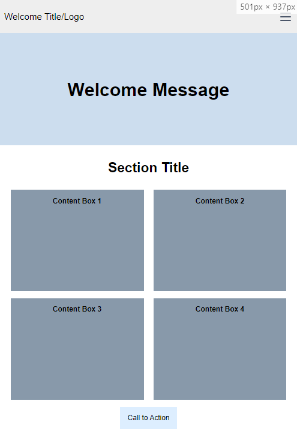
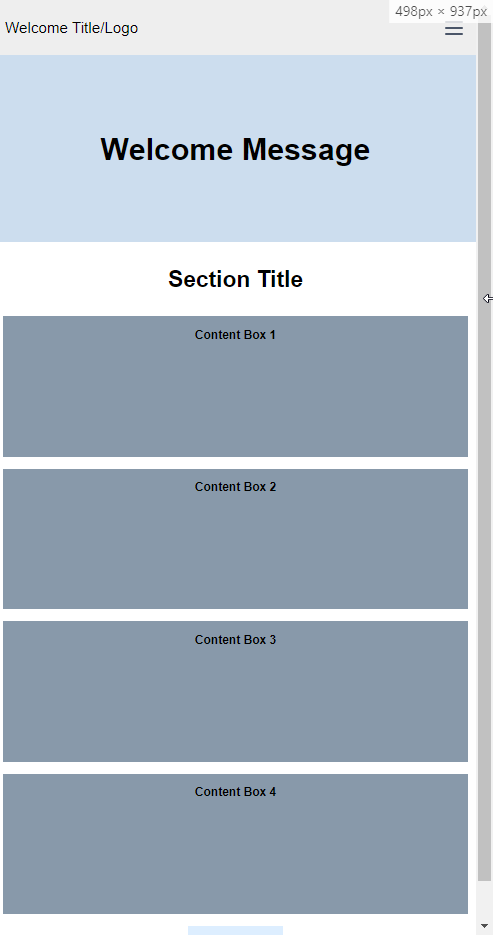

# Remote Assignments

---

## [1. Remote Assignments Week 1 link](https://akirap3.github.io/remote-assignments/week-1/index.html)

- Creating a repository and using GitHub Pages
- Pure HTML/CSS and the Layouts of
  - &gt; 1200px
    
  - &gt; 800px and &lt; 1200px
    
  - &gt; 500px and &lt; 800px
    
  - &lt; 500px
    
- Mobile-first design pattern to perform this assignment
